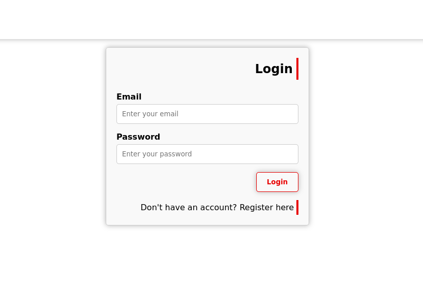
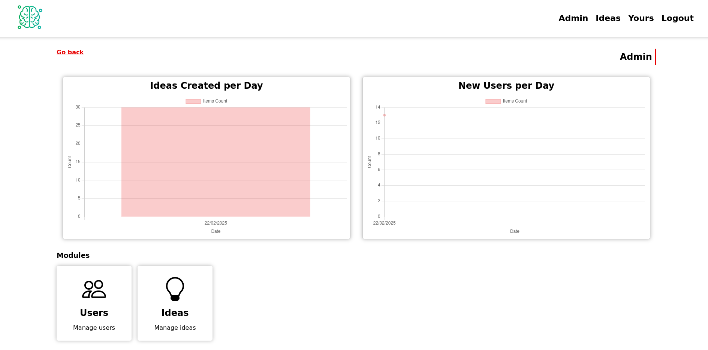
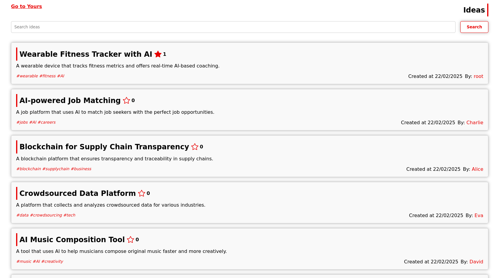
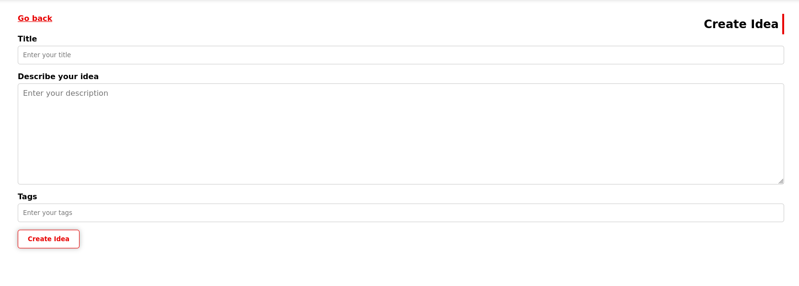

# Sistema de Gerenciamento de Ideias

Sistema web desenvolvido em Node.js para criar e gerenciar ideias, utilizando arquitetura MVC.


## 📸 Screenshots

<div align="center">
    
    
    
    
</div>

## 🚀 Stack Tecnológica

- Node.js + Express
- MySQL + Sequelize ORM
- Redis para Cache
- Handlebars para Views
- Docker e Docker Compose

## 📋 Pré-requisitos

- Node.js (v18+)
- Docker e Docker Compose
- Git

## 🔧 Configuração do Ambiente de Desenvolvimento

1. **Clone o repositório:**
```bash
git clone https://github.com/Jefschlarski/node-js-mvc-idea.git
cd node-js-mvc-idea
```

2. **Configure o ambiente:**
```bash
cp exemple.env .env
# Edite o arquivo .env conforme necessário
```

3. **Inicie os containers:**
```bash
docker-compose -f docker-compose.dev.yml up --build -d
```

4. **Prepare o banco de dados:**
```bash
docker exec -it idea-dev bash
npm run seed
```

## 📝 Licença

Este projeto está sob a licença MIT. Veja o arquivo [LICENSE](LICENSE) para mais detalhes.